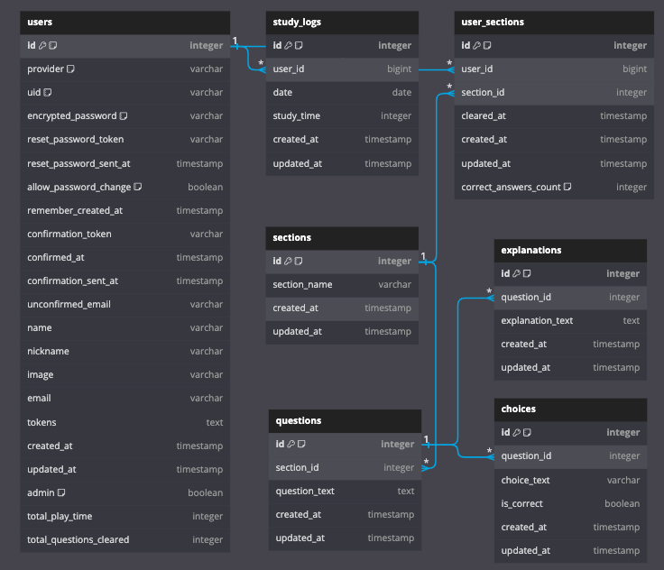

# 貿易実務の知識を定着させよう。(作成途中)
 
- 国際物流の知識を手軽に復習できるクイズアプリです。
- 復習したい内容や学習テーマに合わせて復習することが出来ます。

## 目指した課題解決
  ### ペルソナ
  - 国際物流業界の若手社員
  - メーカーや商社で生産管理業務を行っている若手社員社員
  
  ### ペルソナの課題
  | 課題                       | 解決策                        |
  | ------------------------- | ---------------------------- |
  | 気軽に遊びながら学びたい      |  ログインせずにクイズを楽しめる   |
  | 通勤時間を有効活用したい      | クイズのタイマー機能で学習を効率化 |
  | 続けられるか不安      	     |  豊富な問題数と学習積み上げ機能   |

  ### 課題を解決したいと感じた背景、意図
  - 私は国際物流業界での経験から、このアプリを通じて特定の課題に対する提案を行います。
  - 現場では日々の業務に追われているため、先輩に質問しにくい状況や、覚えなければならない知識の量に苦しんでいる若手社員が多く存在しており、その課題を少しでも改善したいと考えています。
  - インターネット上や社内の共有資料には、詳細な解説が記載されており、それを見て付け焼き刃的に顧客対応はできる一方、忙しい業務の中で、それらを事前に学んでおく機会や繰り返し学び血肉にする機会が欠如しており、初めて聞く用語の説明を求められたり、数ヶ月後に似た案件があった際に知識の解像度が低く、対応できない若手社員が散見され、品質低下につながっています。
  - このような状況の中、ゲーム感覚で楽しく手軽に国際物流の知識を復習できる日本語のクイズがあれば、業務に役立つのではないでしょうか。

## 使用技術
### バックエンド
* 言語: Ruby (v3.2.2)
* フレームワーク: Rails (v7.0.6)
* テストフレームワーク: RSpec

### フロントエンド
* ライブラリ: React (v18.2.0)
* 言語: TypeScript
* UIコンポーネント: Material UI (v5)
* テストフレームワーク: Jest

### インフラ
* データベース: MySQL (v8.0.33)
* コンテナ化: Docker/Docker-compose (開発・テスト・本番環境)
* クラウド: AWS (詳細未定)

### 開発環境/その他
* バージョン管理: Git/GitHub (擬似チーム開発をIssues, Pull Requestsで管理)
* コードエディタ: VScode
* APIテストツール: Postman
* データベース管理ツール: Sequel Ace
* データモデリング: dbdiagram.io

## 実装機能
### ユーザー側
* 認証機能
    * ユーザー新規登録
    * ログイン/ログアウト (トークン認証)
    * パスワード変更
* ダッシュボード
    * 学習進捗の視覚化
    * カレンダーによる学習積み上げ表示
* クイズ機能
    * セクション選択
    * クイズ回答
    * タイムトラッキング機能
    * 解説機能
* 問い合わせ送信機能(Googleフォームを使用)

### 管理者側
* 認証機能
    * 管理者ログイン/ログアウト (トークン認証)
* クイズ管理
    * クイズの作成・更新・削除

## ER図

