## URL
https://logi-quiz.com

- You can enjoy quizzes without logging in via "Let's play quiz now!" at the bottom of the Sign In page.
- Try logging in with the credentials below to explore dashboard features and more.
  | Email               | Password    |
  | ------------------- | ----------- |
  | example@example.com | password123 |

# Master Your Trade & Logistics Knowledge

- A quiz app for easily reviewing international logistics knowledge.
- Study and review topics tailored to your learning goals.

## Local Development Setup

See [LOCAL_SETUP.md](LOCAL_SETUP.md) for full details.

## Problem Statement
  ### Target Users
  - Junior employees in the international logistics industry
  - Junior employees handling production management at manufacturers or trading companies

  ### User Challenges
  | Challenge                                  | Solution                                          |
  | ------------------------------------------ | ------------------------------------------------- |
  | Want to learn casually while having fun     | Enjoy quizzes without logging in                   |
  | Want to make good use of commute time       | Timer feature to streamline study sessions         |
  | Worried about staying motivated             | Extensive question bank and study streak tracking   |

  ### Background & Motivation
- Drawing from my experience in the international logistics industry, I built this app to address specific challenges in the field.
- Many junior employees, myself included, struggle with the sheer volume of knowledge they need to absorb while being overwhelmed by daily tasks. I wanted to help alleviate this problem.
- While detailed explanations are available online and in internal shared documents, they only enable ad-hoc responses to customers. In reality, there is a lack of opportunities to proactively study and repeatedly practice this knowledge amidst a busy workload.
- When asked to explain unfamiliar terminology, or when a similar case arises months later, the lack of retained knowledge prevents quick and appropriate customer responses, leading to quality degradation in the field.
- This quiz app helps alleviate this situation by making it fun and easy to review international logistics knowledge in a game-like format.

## Tech Stack
### Backend
* Language: Ruby (v3.2.2)
* Framework: Rails (v7.0.6)
* Testing: RSpec

### Frontend
* Library: React (v18.2.0)
* Language: TypeScript (partial)
* UI Components: Material UI (v5)
* Testing: Jest

### Infrastructure
* Database: MySQL (v8.0.33)
* Containerization: Docker/Docker-compose
* Cloud: AWS (ECR, ECS, EC2, VPC, RDS, ACM, ELB, Route53, CloudWatch)
* Reverse Proxy: Nginx
* Application Hosting: Vercel

### Development Tools
* Version Control: Git/GitHub (simulated team development managed via Issues and Pull Requests)
* Code Editor: VSCode
* API Testing: Postman
* Database Management: Sequel Ace
* Data Modeling: dbdiagram.io
* Flowcharting: diagrams.net

## Features
### User-Facing
* Authentication
    * User registration
    * Login/Logout (token-based authentication)
    * Password change
* Dashboard
    * Visualization of study time and correct answers
    * Calendar-based study streak display
* Quiz
    * Section selection
    * Quiz answering
    * Time tracking
    * Explanations
* Contact form (via Google Forms)

### Admin-Facing
* Authentication
    * Admin login/logout (token-based authentication)
* Quiz Management
    * Create, update, and delete quizzes

## ER Diagram
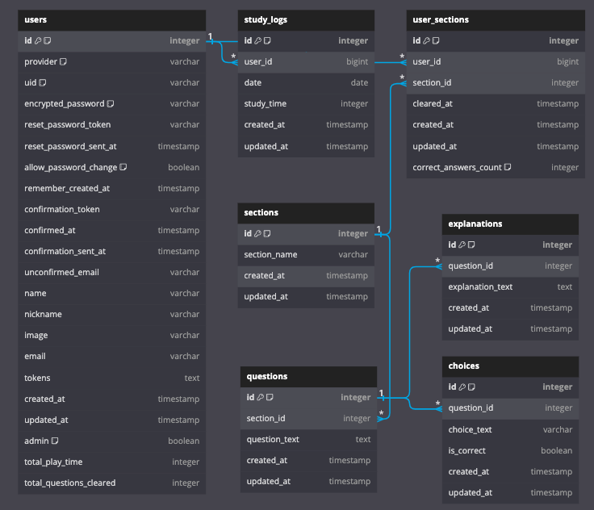

## Infrastructure Diagram

## Screenshots
### Sign In (Not Logged In)
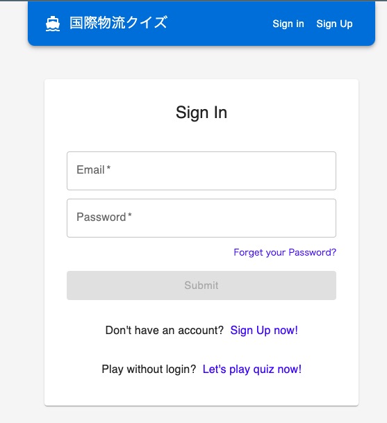

### Home (Not Logged In)
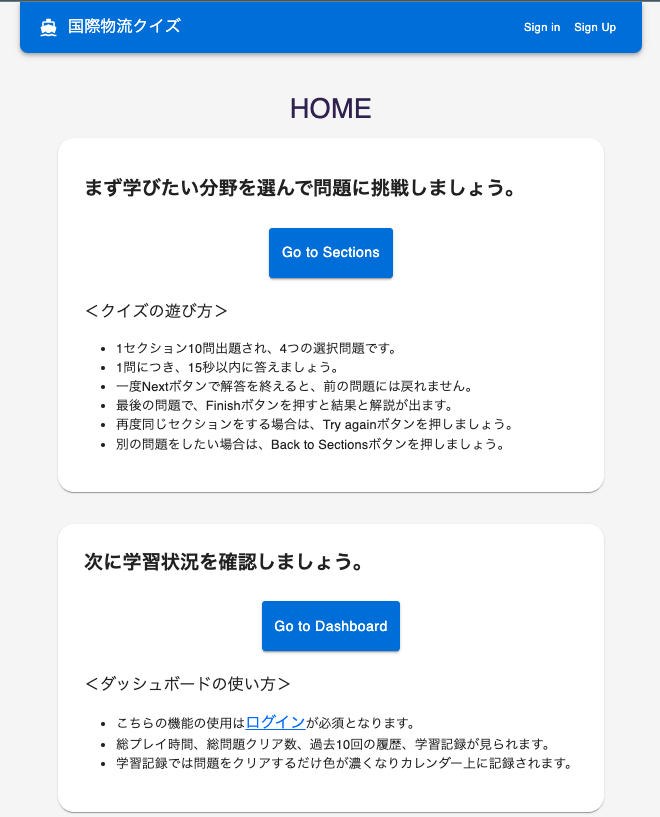

### Section (Not Logged In)
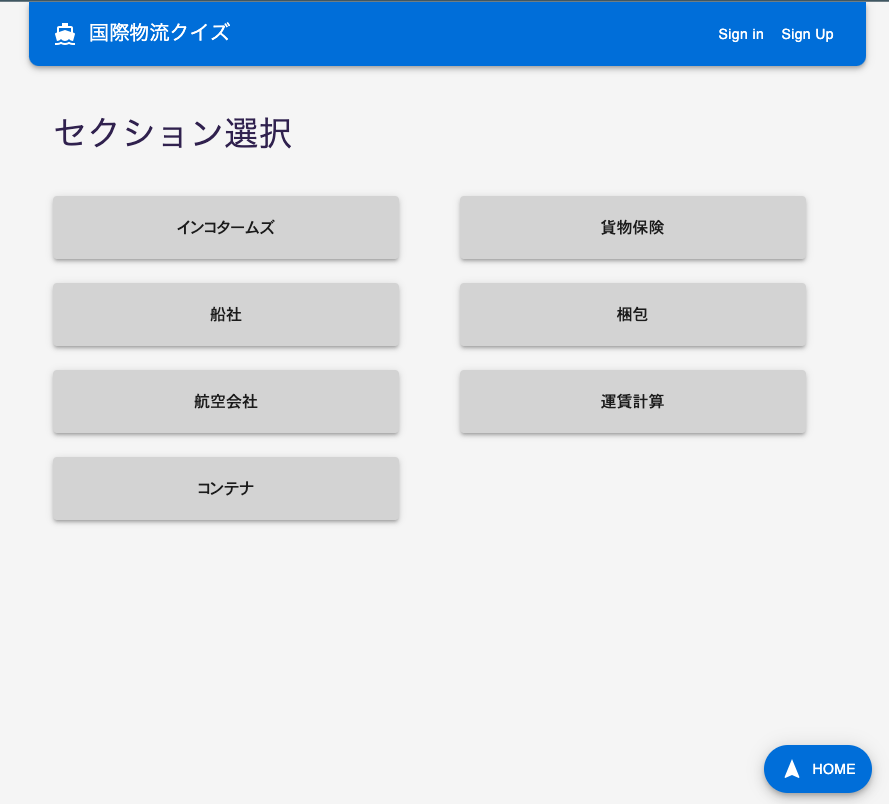

### Quiz
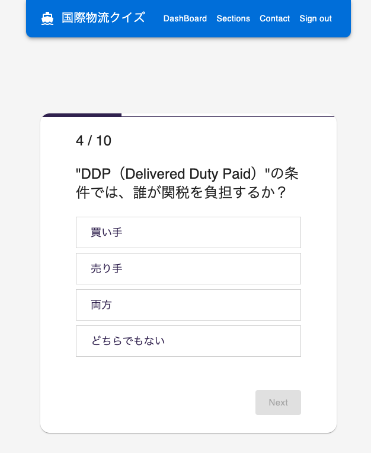

### Quiz Timer
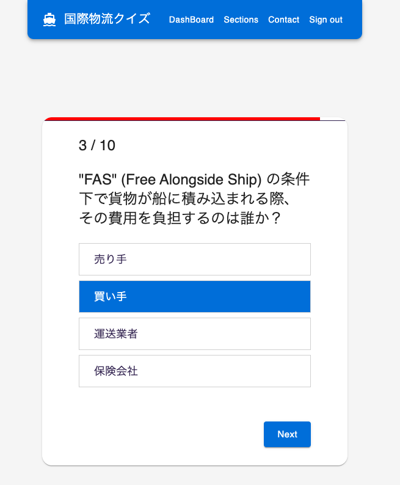

### Explanation
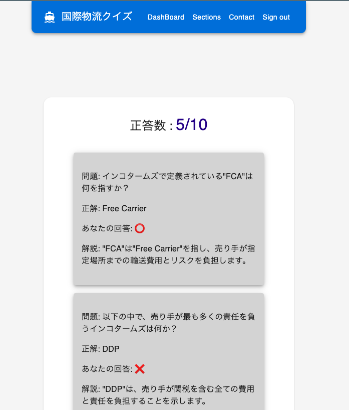

### Dashboard
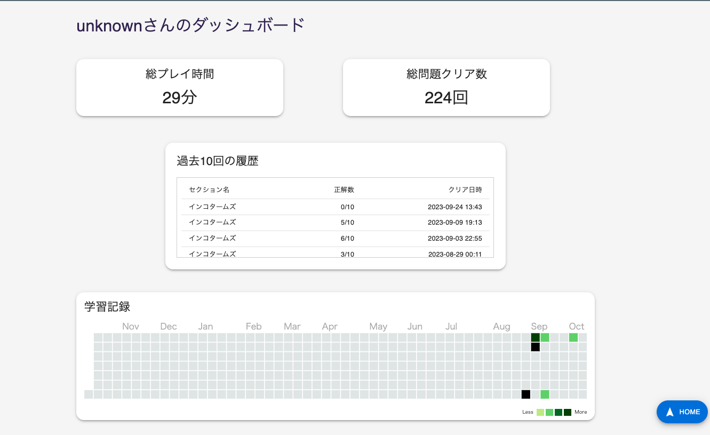

### Create Section
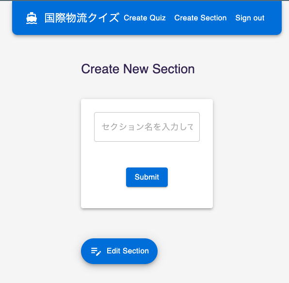

### Edit Section
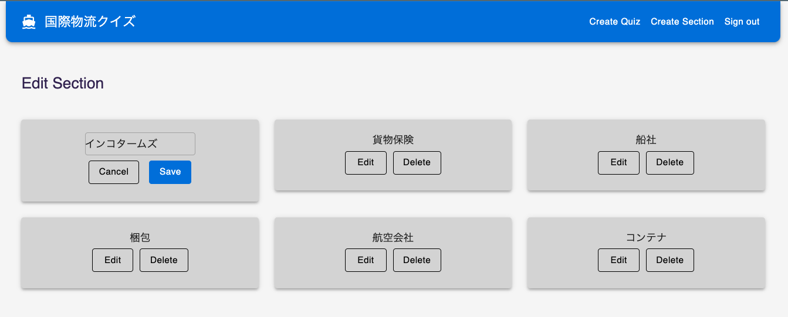

### Create Quiz
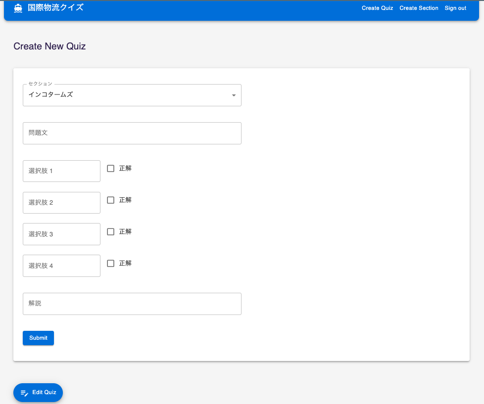

### Edit Quiz
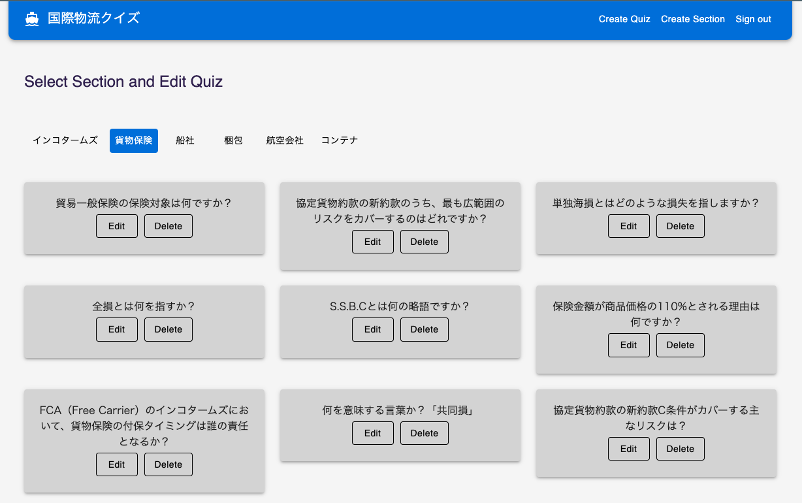

### Delete Quiz
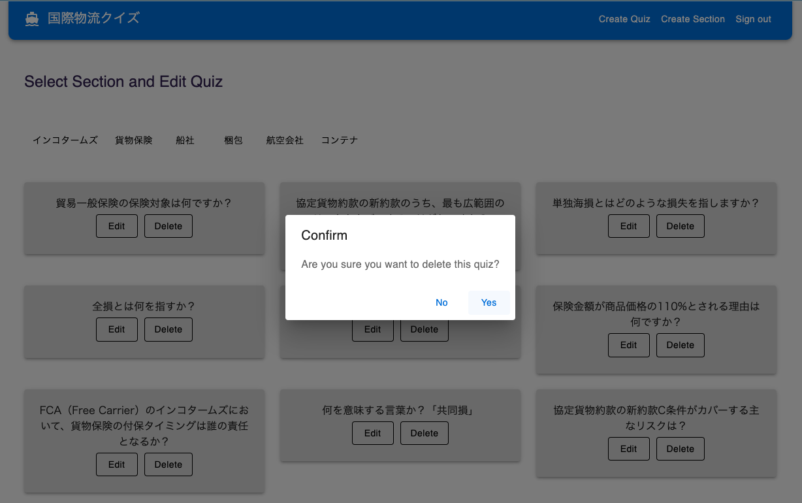

### Update Quiz
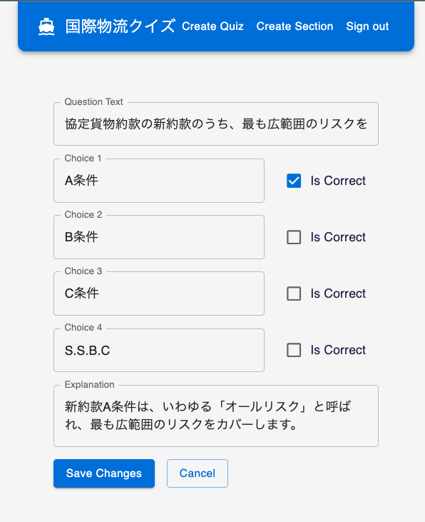