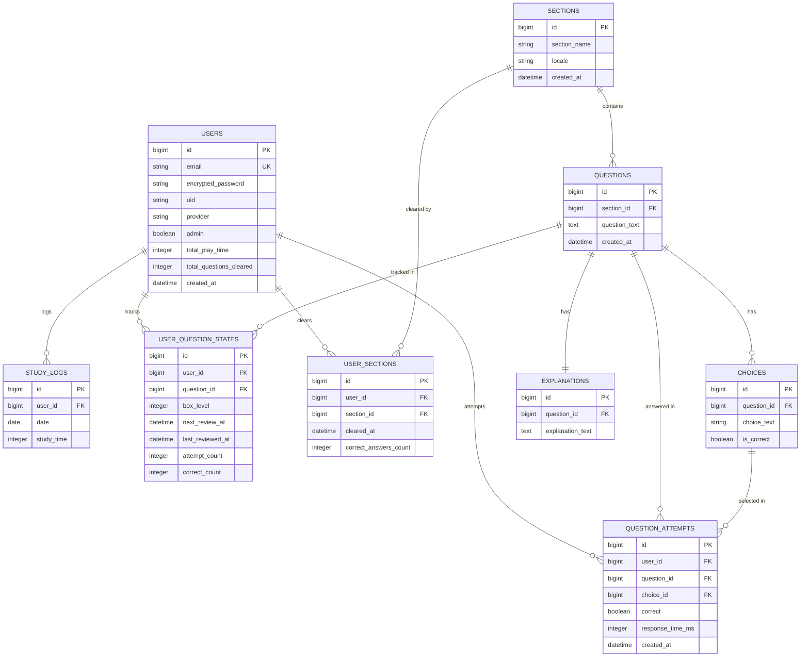

# logi-quiz ER Diagram

`backend/db/schema.rb`（version: 2026_07_04_020907）とモデルの関連（`has_many`/`has_one`/`belongs_to`）から作成。Mermaidのため、GitHub上のMarkdownプレビューでそのままレンダリングされる。

`er-diagram-preview.png` はローカル確認用。以下のコマンドで高解像度に再生成できる（`-s`はPuppeteerのスケール係数、値を上げるほど鮮明になる）:

```bash
npx -y @mermaid-js/mermaid-cli -i er.mmd -o er-diagram-preview.png -w 1600 -H 1200 -s 4 -b white
```

（`er.mmd` は上記の ```mermaid ``` ブロック部分だけを抜き出した一時ファイル。mmdc は `.md` を直接入力にもでき、`-i er-diagram.md -o er-diagram-preview.png` と指定すると図を自動抽出して `er-diagram-preview-1.png` という名前で出力される。）



## 補足

- `EXPLANATIONS.question_id` にDB上のunique制約は無いが、`Question#explanation` は `has_one` のためアプリケーションレベルで1問1解説として扱う。
- `QUESTION_ATTEMPTS.choice_id` はnull許容（タイムアップ時などchoice未選択のケースがあるため）。
- `USER_QUESTION_STATES` はLeitner box方式のSRS（間隔反復）進捗を保持する（`box_level`, `next_review_at` 等）。
